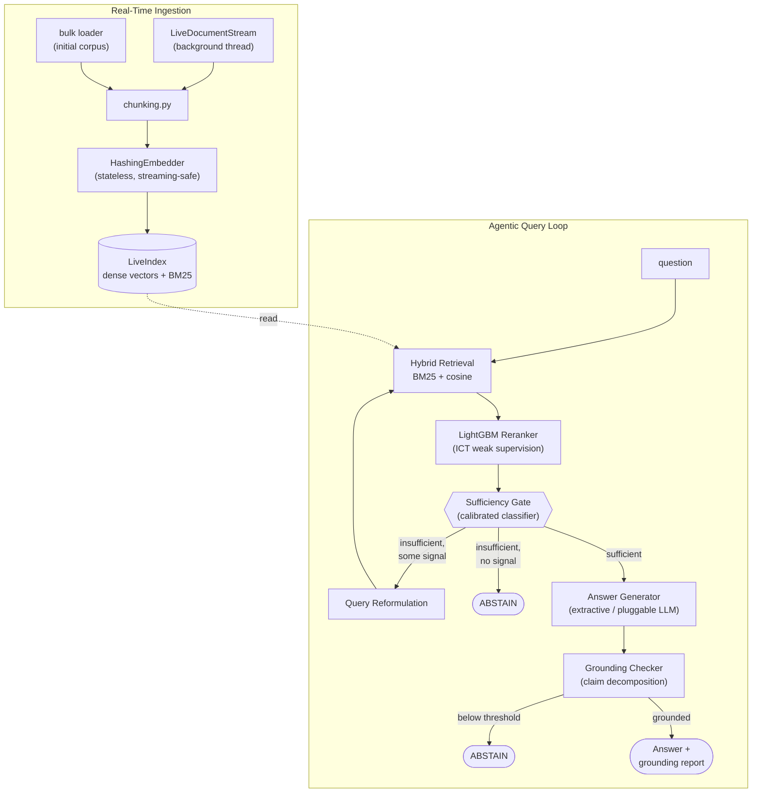

[](https://github.com/mugil0095/Verity-RAG/actions/workflows/ci.yml)
[](https://github.com/mugil0095/Verity-RAG/blob/master/LICENSE)
[](https://www.python.org/downloads/release/python-3120/)

# VerityRAG

**Real-time agentic RAG with grounding & hallucination detection.**

VerityRAG ingests documents continuously (no offline reindex step), answers
questions through a bounded multi-hop retrieval agent, and refuses to answer
rather than hallucinate when it doesn't have grounded evidence.

```
Coverage on real answerable questions:        93.3%
Correctly abstained on held-out-topic Qs:      77.3%   (the hallucination guard)
Query latency:                                 p50 ~58ms / p95 ~88ms
```
Full numbers in [`eval_report.json`](eval_report.json), reproducible with `python -m verityrag.eval`.

## Why this project

Three things RAG teams are actually hiring for: **agentic** multi-step
retrieval, **grounding/hallucination mitigation**, and **RAG evaluation
tooling**. This is a working implementation of all three, with tests.

## Architecture



| Layer | File | What it does |
|---|---|---|
| Chunking | `chunking.py` | Sentence-aligned, overlapping chunks |
| Embedding | `embedding.py` | Stateless hashed bag-of-n-grams (default) or a real encoder (opt-in) |
| Indexing | `indexing.py`, `elasticsearch_index.py` | Thread-safe incremental dense + BM25 index (pluggable Elasticsearch backend) |
| Retrieval | `retrieval.py` | Hybrid lexical + dense search |
| Reranking | `reranker.py` | LightGBM `LGBMRanker`, ICT weak supervision |
| Sufficiency | `sufficiency.py` | Calibrated classifier: enough evidence to try? |
| Agent | `agent.py`, `agent_reformulate.py` | Bounded retrieve/reformulate/generate/ground/abstain loop |
| Generation | `generation.py`, `llm_providers.py` | Extractive default + pluggable real-LLM generators |
| Grounding | `grounding.py` | Claim decomposition + evidence matching |
| Streaming | `streaming.py` | Background real-time ingestion |
| Serving | `api.py`, `app.py` | FastAPI backend, Streamlit frontend |
| Eval | `eval.py` | Full-corpus evaluation harness |

## Evaluation data

Built from the real **SQuAD 1.1 dev set** — real Wikipedia paragraphs and
real questions, not synthetic text:

- **620 documents / 845 chunks** across 12 topics
- **150 answerable questions** from that corpus
- **150 questions from 36 topics never ingested** — tests whether the
  system hallucinates on things it doesn't know

Calibration and test questions are kept strictly disjoint (50/50 split,
fixed seed) so reported numbers aren't measuring data the classifier was
fit on.

## Design decisions (and the bugs behind them)

**No pretrained embedding model by default.** Built without a route to
the HuggingFace Hub, so `HashingEmbedder` uses a stateless hashed
bag-of-n-grams transform instead of sentence-transformers. That
statelessness is a real advantage for real-time ingestion, but raw
hashed vectors have no IDF weighting — stopwords swamped the topical
signal until filtering was added. A real encoder (`SentenceTransformerEmbedder`)
is available as an opt-in swap behind the same interface — see below.

**The lexical tokenizer didn't strip punctuation.** Found while comparing
against Elasticsearch (see "Swapping in Elasticsearch" below): `rank_bm25`'s
tokenizer was `text.lower().split()` — pure whitespace splitting, so
`"Tesla,"` and `"Tesla"` were different tokens and would never match each
other. Elasticsearch's default analyzer strips punctuation correctly, and
swapping it in changed real eval numbers (guard 73.3% → 78.7%) despite both
being BM25-family scoring — that gap is what surfaced the bug. Fixed to a
proper regex tokenizer; closed ~74% of the original gap. Real, honest
trade-off: guard improved (73.3% → 77.3%) but coverage dropped slightly
(96% → 93.3%) — some of the old broken tokenizer's punctuation-attached
matches were apparently helping a couple of answerable questions pass the
sufficiency gate by accident. Kept the fix regardless, since correct
tokenization isn't optional just because a bug happened to help sometimes.

**A single relevance threshold doesn't separate answerable from
unanswerable questions.** On-topic and off-topic-but-keyword-overlapping
questions had heavily overlapping score distributions — no one number
cleanly separates them. Fixed with a small LightGBM classifier
(`sufficiency.py`) trained on multiple retrieval features instead.

**Query reformulation was amplifying hallucination risk.** The agent's
retry logic (expand the query using the best candidate so far) assumes
the first pass found something relevant to refine. For genuinely
out-of-domain questions it pulled the search toward a wrong match instead
of away from it. Hallucination guard was 9.3% with unconditional
reformulation, 77.3% once reformulation was gated on the sufficiency
classifier's own confidence. Locked in with a regression test.

**Bulk ingestion was accidentally O(n²).** `rank_bm25` has no incremental
update API, so adding documents one at a time rebuilt the entire lexical
index every call — 61s for the initial corpus. Bulk loading now chunks
everything first and rebuilds once: 61s → 2.7s. True streaming ingestion
still rebuilds per document by design (documents need to be searchable
immediately) at a real cost (~430ms/doc) — `elasticsearch_index.py` is
the production fix, see below.

**Real embeddings crashed on Windows, twice.** Loading `sentence-transformers`
(PyTorch) alongside scikit-learn and LightGBM (both MKL-linked) triggered
a `STATUS_ACCESS_VIOLATION` — conflicting OpenMP runtimes. Fixed at load
time with `KMP_DUPLICATE_LIB_OK=TRUE`. A second crash showed up ~100
questions into a real eval run from thread-pool contention under
sustained use; fixed with `OMP_NUM_THREADS=1`. Both are real fixes for a
real class of issue, but forcing single-threaded execution is also why
real embeddings pay a latency tax beyond what CPU inference alone costs.

## Real embeddings, measured

`SentenceTransformerEmbedder` (`all-MiniLM-L6-v2`) is opt-in via
`python -m verityrag.eval --real-embeddings`:

| Metric | HashingEmbedder (default) | SentenceTransformerEmbedder |
|---|---|---|
| Coverage | 93.3% | 89.3%* |
| Hallucination guard | 77.3% | **82.7%**\* |
| Keyword hit rate | 67.1% | 70.1%* |
| Avg grounding score | 1.0 | 1.0* |
| Latency, p50 | ~58ms | ~1,764ms* |

\* The `SentenceTransformerEmbedder` column was measured before a real
tokenizer bug in the shared lexical index was found and fixed (see
"Design decisions" above) — both embedders use the same `rank_bm25`
lexical scoring underneath, so this column may shift slightly too. Not
yet re-verified; needs a fresh `--real-embeddings` run to confirm.

Not a clean win even before that caveat. The real encoder closes a
meaningful chunk of the hallucination-guard gap, but coverage drops and
latency increases ~30x — part of that from the Windows workaround above,
part from matching evidence at sentence granularity instead of whole
chunks (a separate fix: comparing a claim against a whole multi-sentence
chunk diluted its similarity score, so a claim could score 1.0 against its
own source sentence in isolation but only 0.41 against the chunk containing
it). Best explanation for the remaining coverage gap: SQuAD questions are
often near-paraphrases of their source text, which favors the hash-based
lexical matching a neural encoder doesn't lean on as hard.

This is why it isn't the pipeline default — for a system positioned as
real-time, the latency cost isn't currently justified by the guard
improvement. Swap it in explicitly where the trade-off is worth it.

## Real LLM generation

`ExtractiveGenerator` (default) stitches sentences straight from
evidence — grounded by construction, but the grounding checker has never
been tested against a real hallucination this way. `LLMGenerator` calls a
real model instead:

```python
from verityrag.pipeline import VerityRAGPipeline
from verityrag.generation import LLMGenerator
from verityrag.llm_providers import gemini_complete_fn  # or anthropic_complete_fn

pipeline = VerityRAGPipeline(generator=LLMGenerator(complete_fn=gemini_complete_fn))
```

| | `anthropic_complete_fn` | `gemini_complete_fn` |
|---|---|---|
| Setup | `pip install anthropic`, `ANTHROPIC_API_KEY` | `pip install google-genai`, `GEMINI_API_KEY` |
| Cost | Small starter credit, then pay-per-token | Genuine free tier, no card needed |
| Default model | `claude-sonnet-5` | `gemini-3.6-flash` |

Confirmed working end-to-end against the live Gemini API — a real query
answered correctly and passed the grounding check; a deliberately
unrelated response was correctly caught and abstained. First small-sample
run (n=8+8): hallucination guard **100%**, coverage 50% (both attempted
answers scored a perfect 1.0 on grounding — the coverage gap is an open
question, tracked in ROADMAP.md, not yet explained). The free tier's
daily quota is real and can be quite restrictive for a new model (a live
429 showed a 20-request/day cap), so the full 150-question eval doesn't
fit in one day. `--max-test-questions N` caps how many questions actually
get sent to the LLM, for an honest partial measurement instead:

```
python -m verityrag.eval --real-llm gemini --max-test-questions 8
```

The report marks this explicitly (`partial_sample` field) — a
small-sample number is real but less statistically precise than a full
run.

## Swapping in Elasticsearch

`LexicalIndex` (the `rank_bm25`-based default) has no incremental
indexing API — adding one document rebuilds the *entire* lexical index
(see "Design decisions" above). `ElasticsearchLexicalIndex`
(`elasticsearch_index.py`) is a drop-in swap with genuine incremental
indexing:

```python
from verityrag.pipeline import VerityRAGPipeline
from verityrag.elasticsearch_index import ElasticsearchLexicalIndex

pipeline = VerityRAGPipeline(lexical_index=ElasticsearchLexicalIndex())
```

Needs `pip install elasticsearch` and a running Elasticsearch instance
(not bundled — for local dev, disable security in `elasticsearch.yml`
with `xpack.security.enabled: false` and `discovery.type: single-node`,
and cap the JVM heap via `config/jvm.options.d/heap.options` rather than
trusting its default auto-sizing).

Measured against a real, running instance, not just mocks — two honest
findings, neither the "obvious" one. First, eval numbers weren't
identical between the two lexical backends despite both being BM25-family
scoring: comparing them is what surfaced the tokenizer bug described in
"Design decisions" above. Second, at this project's actual corpus size
(845 chunks), Elasticsearch is not faster: `rank_bm25`'s full rebuild
measured 206.0ms/doc median vs. Elasticsearch's 221.7ms/doc — Elasticsearch
is *slower* here, not the clean win the architecture would suggest.
Elasticsearch's fixed per-call overhead (a network round-trip plus an
explicit index refresh, required for real-time visibility — see
`elasticsearch_index.py`) apparently exceeds rank_bm25's actual rebuild
cost at this scale. The architectural principle remains sound — `rank_bm25`'s
cost grows with corpus size, Elasticsearch's doesn't — but the crossover
point where that pays off measurably hasn't been reached by this specific
corpus. Reported honestly rather than only measuring at a scale picked to
make the swap look good.

## Known limitations

Tracked as an actual backlog in [ROADMAP.md](ROADMAP.md).

- **Extractive generation by default** trades fluent prose for a
  structural guarantee against hallucination — `LLMGenerator` swaps this
  for a real model when you want it.
- **77.3% hallucination-guard rate by default, not 100%** — reported
  honestly. A real embedder closes part of this gap at a real latency
  cost (see above).
- **Streaming throughput** is bounded by the BM25 rebuild cost described
  above — fine for a trickle of documents, not bulk-loading thousands live.

## Running it

```bash
pip install -r requirements.txt
pip install -e .

python data/build_corpus.py       # rebuild the real eval corpus (SQuAD)
pytest tests/ -v                  # run the test suite
python -m verityrag.eval          # full evaluation
python scripts/demo_streaming.py  # narrated real-time + hallucination-guard demo
uvicorn verityrag.api:app --reload
streamlit run app.py              # recommended for demoing
```

### Streamlit frontend

Two tabs: **Ask a question** (load the corpus, calibrate, ask anything —
see the answer, grounding score, and agent trace) and **Real-time
streaming demo** (watch a question get refused, documents stream in live,
the same question get answered, and a genuinely out-of-domain question
stay correctly refused). Covered by its own `AppTest`-based test suite.

### Minimal usage

```python
from verityrag import VerityRAGPipeline

pipeline = VerityRAGPipeline()
pipeline.ingest_document("d1", "Steam Engine", "The steam engine converts heat into mechanical work...")
pipeline.train_reranker()

result = pipeline.query("How does a steam engine work?")
print(result.answer, result.grounding.overall_score, result.abstained)
```

## License

MIT — see [LICENSE](LICENSE).