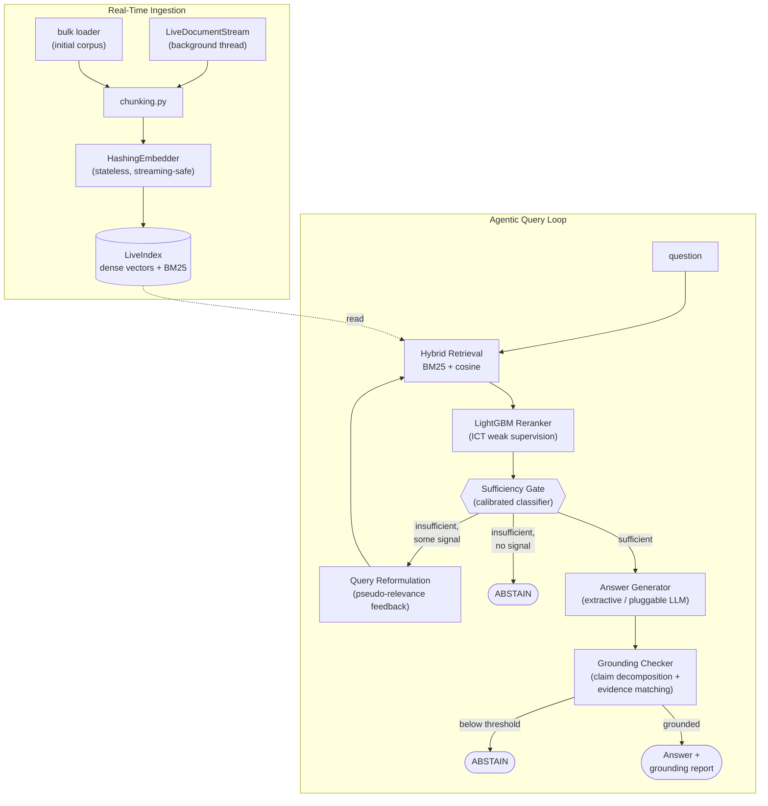

# VerityRAG

**Real-time agentic RAG with grounding & hallucination detection.**

VerityRAG ingests documents continuously (no offline reindex step), answers
questions through a bounded multi-hop retrieval agent, and refuses to answer
rather than hallucinate when it doesn't have grounded evidence — verified on
a real corpus, not a toy example.

```
Coverage on real answerable questions:        96.0%
Correctly abstained on held-out-topic Qs:      73.3%   (the hallucination guard)
Query latency:                                 p50 ~150ms / p95 ~400ms
```
Full numbers in [`eval_report.json`](eval_report.json), reproducible with `python -m verityrag.eval`.

## Why this project

Three of the things RAG teams are actually hiring for right now: **agentic**
multi-step retrieval (not single-shot retrieve-then-generate), **grounding /
hallucination mitigation** (the biggest trust problem in production RAG), and
**RAG evaluation tooling** (RAGAS/TruLens-style faithfulness scoring). This
project is a working implementation of all three, end to end, with tests.

## Architecture



| Layer | File | What it does |
|---|---|---|
| Chunking | `chunking.py` | Sentence-aligned, overlapping chunks |
| Embedding | `embedding.py` | Stateless hashed bag-of-n-grams (no model download needed — see below) |
| Indexing | `indexing.py` | Thread-safe incremental dense + BM25 index |
| Retrieval | `retrieval.py` | Hybrid lexical + dense search |
| Reranking | `reranker.py` | LightGBM `LGBMRanker`, trained via Inverse Cloze Task weak supervision |
| Sufficiency | `sufficiency.py` | Calibrated classifier deciding "do we have enough to even try" |
| Agent | `agent.py`, `agent_reformulate.py` | Bounded retrieve/reformulate/generate/ground/abstain loop |
| Generation | `generation.py` | Extractive default + pluggable `LLMGenerator` interface |
| Grounding | `grounding.py` | Claim decomposition + semantic/lexical evidence matching |
| Streaming | `streaming.py` | Background real-time ingestion |
| Serving | `api.py` | FastAPI `/ingest`, `/query`, `/health`, `/stats` |
| Frontend | `app.py` | Streamlit UI: ask questions, run the live-streaming demo |
| Eval | `eval.py` | Full-corpus evaluation harness |

## Evaluation data

Built from the real **SQuAD 1.1 dev set** (`data/build_corpus.py`) — real
Wikipedia paragraphs and real human-written questions, not synthetic text:

- **620 documents / 845 chunks** across 12 topics, ingested as the corpus
- **150 real questions** answerable from that corpus (`eval_answerable.json`)
- **150 real questions from 36 different topics never ingested**
  (`eval_unanswerable.json`) — used specifically to test whether the system
  hallucinates on things it doesn't know

Calibration and reported-metric questions are kept strictly disjoint (a
50/50 split with a fixed seed) so the reported numbers aren't measuring the
same data the sufficiency classifier was fit on.

## Design decisions (and the bugs that shaped them)

This section exists because the debugging process is the most interesting
part of the project, and I'd rather show real engineering iteration than
pretend it worked perfectly the first time.

**No pretrained neural embedding model.** This was built in a sandboxed
environment with no route to the HuggingFace Hub or any embedding API, so
`embedding.py` uses `sklearn.HashingVectorizer` — a stateless, hash-based
bag-of-n-grams transform — instead of sentence-transformers. That
statelessness turned out to be a genuine advantage for real-time ingestion
(no fitting/refitting step, ever), but it has a real weakness: without IDF
weighting, common words dominated short texts and swamped the topical
signal. Measured directly: an off-topic query scored *higher* raw cosine
similarity than an on-topic one until stopword filtering was added. Fixed by
filtering stopwords in the vectorizer. **Production fix:** swap
`HashingEmbedder` for a real dense encoder behind the same `.embed()`
interface — the rest of the system doesn't care how the vector was produced.

**A single relevance threshold doesn't separate answerable from
unanswerable questions.** The first version gated the agent's "do I have
enough evidence" decision on one number (top-1 cosine similarity). Measured
on the real corpus: on-topic and off-topic-but-coincidentally-keyword-
overlapping questions had heavily overlapping score distributions (0.075–0.574
vs. 0.040–0.221) — no single threshold cleanly separates them. Fixed by
training a small LightGBM classifier (`sufficiency.py`) on multiple retrieval
features (top-1 and top-3 dense scores, raw BM25 score, score gap, candidate
count above a floor) instead of hand-picking one number.

**Query reformulation was amplifying hallucination risk, not reducing it.**
The biggest bug, and the most instructive one. The agent's retry logic
(pseudo-relevance feedback: expand the query using terms from the best
candidate so far) is a real, standard IR technique — but it assumes the
first-pass retrieval found *something* relevant to refine. For genuinely
out-of-domain questions, the "best candidate" is just noise, and expanding
the query with its vocabulary pulled the search *toward* that wrong match
instead of away from it, letting a confidently-wrong answer pass the
sufficiency gate on the second hop. Measured on the full corpus: the
hallucination-guard rate was **9.3%** with unconditional reformulation and
**73.3%** once reformulation was gated on the sufficiency classifier's own
calibrated confidence (only retry when hop 0 looks *plausible but
incomplete*, not when it's already confidently rejected). Locked in with a
regression test (`test_reformulation_does_not_fire_when_hop0_confidently_rejected`).

**Bulk ingestion was accidentally O(n²).** `rank_bm25` has no incremental
update API, so adding documents one at a time — correct for genuine
real-time streaming — meant rebuilding the *entire* lexical index on every
single call. Loading the initial 620-document corpus that way took 61
seconds. Fixed by giving bulk loading (`ingest_documents`) its own code path
that chunks everything first and rebuilds the lexical index exactly once:
**61s → 2.7s.** The true one-at-a-time streaming path (`ingest_document`,
used by `LiveDocumentStream`) still rebuilds per call by design — streamed
documents need to be searchable immediately — and this has a real, measured
cost: streaming 6 individual documents into an already-732-chunk index took
~2.9s (~430ms/doc) versus ~4ms/doc in the bulk path. **Production fix:**
swap the lexical index for Elasticsearch/OpenSearch, which supports true
incremental indexing (this is the same near-real-time refresh model
Elasticsearch itself uses).

## Known limitations

Tracked as an actual backlog in [ROADMAP.md](ROADMAP.md), not just prose here.

- **Extractive generation by default.** The default generator selects and
  stitches sentences straight from retrieved evidence rather than writing
  fluent prose — it's "grounded by construction" and needs no external API,
  which is why `avg_grounding_score` is 1.0 in the eval report. The
  `keyword_hit_rate` of 68% (whether the literal gold-answer text appears
  in the response) reflects this: a real LLM behind the `LLMGenerator`
  interface would likely score higher on precision at the cost of needing
  the grounding checker to do real work (LLMs *can* hallucinate even with
  correct context — extractive generation structurally can't).
- **73.3% hallucination-guard rate, not 100%.** Reported honestly rather
  than tuned to look better. The residual error traces back to the
  embedding layer's limits (see above) — a neural encoder would very likely
  close more of this gap.
- **One-at-a-time streaming throughput** is bounded by the BM25 rebuild
  cost described above; fine for a trickle of new documents, not for
  bulk-loading thousands of documents live.

## Running it

```bash
pip install -r requirements.txt
pip install -e .

# Rebuild the real evaluation corpus (fetches the SQuAD dev set)
python data/build_corpus.py

# Run the test suite (58 tests)
pytest tests/ -v

# Run the full evaluation against the real 620-doc corpus
python -m verityrag.eval

# Narrated demo: real-time streaming + hallucination guard, end to end
python scripts/demo_streaming.py

# Run the API
uvicorn verityrag.api:app --reload

# Run the Streamlit frontend (recommended for demoing this project)
streamlit run app.py
```

### Streamlit frontend

`app.py` gives you a real UI over the same pipeline that powers the API —
useful for actually demoing this rather than reading code. Two tabs:

- **Ask a question** — load the real corpus (sidebar), optionally calibrate
  the sufficiency gate, then ask anything; see the answer, grounding score,
  claim-level grounding breakdown, agent trace, and evidence used.
- **Real-time streaming demo** — a one-click version of
  `scripts/demo_streaming.py`: watch a question get refused, watch documents
  stream into the live index with a real progress bar (backed by the actual
  `LiveDocumentStream` background thread, not a fake animation), then watch
  the same question get answered — plus a genuinely out-of-domain question
  that stays correctly refused throughout.

Covered by its own test suite (`tests/test_app.py`) using Streamlit's
`AppTest` framework — same TDD approach as the rest of the project, not just
manual clicking.

### Minimal usage

```python
from verityrag import VerityRAGPipeline

pipeline = VerityRAGPipeline()
pipeline.ingest_document("d1", "Steam Engine", "The steam engine converts heat into mechanical work...")
pipeline.train_reranker()

result = pipeline.query("How does a steam engine work?")
print(result.answer, result.grounding.overall_score, result.abstained)
```

### Swapping in a real LLM

```python
from verityrag import VerityRAGPipeline, LLMGenerator

def call_claude(prompt: str) -> str:
    # call your LLM provider of choice here
    ...

pipeline = VerityRAGPipeline(generator=LLMGenerator(complete_fn=call_claude))
```

The grounding checker runs on whatever the generator produces either way —
useful because a real LLM, unlike the extractive default, can genuinely
hallucinate even with correct evidence in context.

## License

MIT — see [LICENSE](LICENSE).
